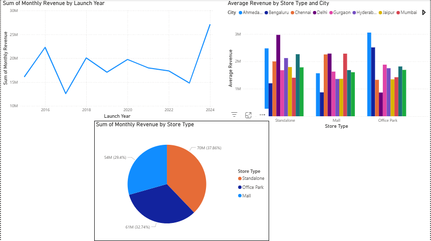

# Chaayos Store Performance Dashboard (Power BI Project)

This project presents an interactive Power BI dashboard to analyze store-level performance for **Chaayos**, a modern Indian tea café chain.

The dashboard provides insights into **monthly revenue trends, store type comparisons, and city-wise performance**, helping stakeholders make informed decisions for expansion, optimization, and marketing.

---

## 📊 Dashboard Features

### 1. **Monthly Revenue Analysis**
- Tracks total revenue over time
- Identifies revenue spikes and dips

### 2. **Store Type vs City Comparison**
- Compares performance of different store types (e.g., High-Street, Mall, Airport)
- Highlights which cities drive higher sales per store type

### 3. **Store Type-Wise Insights**
- Allows comparison of top-performing and underperforming store types
- Helps prioritize support and strategy

---

## 📁 Files Included

| File Name | Description |
|-----------|-------------|
| `Chaayos_Sales_Dashboard.pbix` | Power BI dashboard file |
| `README.md` | Project documentation |
| `chaayos_dashboard_screenshot.png` | A visual preview of the dashboard |

---

## 🧰 Tools & Skills Used

- **Power BI**: Data modeling, DAX, and interactive visualization
- **Excel**: Data pre-processing
- **Data Analysis**: Revenue patterns, segmentation, aggregation
- **Visualization Types**: Clustered Column Chart, Bar Charts, Card KPIs

---

## 🎯 Business Impact

This dashboard simulates how a real business like Chaayos can:
- Track performance at the micro (store) level
- Make data-driven decisions around store expansion or closure
- Optimize marketing and operations based on regional performance

---

## 📸 Preview
 


---

### A/B Test Example — Direct Mail (sample design)

**Objective:** Increase new-customer conversion via Direct Mail.  
**Hypothesis:** Personalized offer (cashback + product suggestion) to high-LTV prospects will lift conversion **≥10%** vs generic offer.  
**Design:** Randomized A/B — Control: generic offer; Treatment: personalized offer.  
**Cohort:** Top 20% estimated-LTV prospects (CRM + POS signals).  
**Primary metric:** Conversion rate (new accounts / mailed prospects).  
**Secondary metrics:** Avg charge per new account, CAC, 30-day retention.  
**Sample & duration:** ~5,000 prospects/arm (or power-calc); run 4 weeks.  
**Success criteria:** Statistically significant lift (p < 0.05) and acceptable CAC:LTV tradeoff.  
**Notes:** Data is simulated — adapt cohort/sample sizes to real CRM; SQL snippets and dashboard slices prepared for analysis.

---

## SQL & Dashboard Snippets (Cohort + Metrics)

> **Note:** replace table/column names with your schema. These snippets produce cohort-level conversion, avg charge, CAC and 30-day retention metrics for an A/B Direct Mail analysis.

### 1) Standard SQL (CTE) — cohort + conversion / avg charge / CAC / 30-day retention
```sql
-- Cohort: top-20% LTV prospects mailed in a campaign window
WITH mailed AS (
  SELECT p.prospect_id, p.mail_date, p.offer_type, p.acq_cost
  FROM prospects p
  WHERE p.segment = 'top_20_ltv'
    AND p.mail_date BETWEEN '2025-01-01' AND '2025-01-31'
),

orders_30d AS (
  SELECT m.prospect_id,
         MIN(t.order_date) AS first_order_date,
         SUM(t.order_amount) AS total_amount_30d
  FROM mailed m
  LEFT JOIN transactions t
    ON t.prospect_id = m.prospect_id
   AND t.order_date BETWEEN m.mail_date AND DATE_ADD(m.mail_date, INTERVAL 30 DAY)
  GROUP BY m.prospect_id
),

metrics AS (
  SELECT
    m.offer_type,
    COUNT(DISTINCT m.prospect_id) AS mailed_count,
    COUNT(DISTINCT CASE WHEN o.first_order_date IS NOT NULL THEN m.prospect_id END) AS converted_count,
    ROUND(100.0 * COUNT(DISTINCT CASE WHEN o.first_order_date IS NOT NULL THEN m.prospect_id END) / NULLIF(COUNT(DISTINCT m.prospect_id),0), 2) AS conversion_pct,
    ROUND(COALESCE(SUM(o.total_amount_30d),0) / NULLIF(COUNT(DISTINCT CASE WHEN o.first_order_date IS NOT NULL THEN m.prospect_id END),0), 2) AS avg_charge_per_converted,
    ROUND(SUM(m.acq_cost) / NULLIF(COUNT(DISTINCT CASE WHEN o.first_order_date IS NOT NULL THEN m.prospect_id END),0), 2) AS cac
  FROM mailed m
  LEFT JOIN orders_30d o ON o.prospect_id = m.prospect_id
  GROUP BY m.offer_type
)
SELECT * FROM metrics;

```markdown

-- Spark / Hive SQL note:
-- Replace `DATE_ADD(m.mail_date, INTERVAL 30 DAY)` with the engine-friendly form:
--   Hive / Spark SQL:    date_add(m.mail_date, 30)
--   MySQL / BigQuery:    DATE_ADD(m.mail_date, INTERVAL 30 DAY)
--   Presto/Trino:        date_add('day', 30, m.mail_date)
--
-- Example replacement in the CTE join condition:
AND t.order_date BETWEEN m.mail_date AND date_add(m.mail_date, 30)


---

PySpark DataFrame example (cohort -> metrics)

# Assumes spark DataFrames: prospects_df, transactions_df
import pyspark.sql.functions as F
from pyspark.sql import SparkSession

# filter mailed cohort
mailed = prospects_df.filter(
    (F.col("segment") == "top_20_ltv") &
    (F.col("mail_date").between("2025-01-01", "2025-01-31"))
).select("prospect_id", "mail_date", "offer_type", "acq_cost")

# join transactions within 30 days of mail_date
orders_30d = (
    transactions_df.alias("t")
    .join(mailed.alias("m"), on="prospect_id", how="inner")
    .filter((F.col("t.order_date") >= F.col("m.mail_date")) &
            (F.col("t.order_date") <= F.date_add(F.col("m.mail_date"), 30)))
    .groupBy("prospect_id")
    .agg(
        F.min("order_date").alias("first_order_date"),
        F.sum("order_amount").alias("total_amount_30d")
    )
)

# compute per-offer metrics
metrics_df = (
    mailed.join(orders_30d, on="prospect_id", how="left")
    .groupBy("offer_type")
    .agg(
        F.countDistinct("prospect_id").alias("mailed_count"),
        F.countDistinct(F.when(F.col("first_order_date").isNotNull(), F.col("prospect_id"))).alias("converted_count"),
        (100 * F.countDistinct(F.when(F.col("first_order_date").isNotNull(), F.col("prospect_id")))/
         F.countDistinct("prospect_id")).alias("conversion_pct"),
        (F.sum("total_amount_30d") / F.nullif(F.countDistinct(F.when(F.col("first_order_date").isNotNull(), F.col("prospect_id"))), F.lit(0))).alias("avg_charge_per_converted"),
        (F.sum("acq_cost") / F.nullif(F.countDistinct(F.when(F.col("first_order_date").isNotNull(), F.col("prospect_id"))), F.lit(0))).alias("cac")
    )
)
metrics_df.show()


---

Power BI — DAX measures (create as New Measure)

-- Mailed Count
Mailed Count = DISTINCTCOUNT(Prospects[ProspectID])

-- Converted Count (first order within 30 days)
Converted Count =
CALCULATE(
  DISTINCTCOUNT(Transactions[ProspectID]),
  Transactions[OrderDate] >= MIN(Prospects[MailDate]) &&
  Transactions[OrderDate] <= MIN(Prospects[MailDate]) + 30
)

-- Conversion Rate
Conversion Rate = DIVIDE([Converted Count], [Mailed Count], 0)

-- Avg Charge per Converted
Avg Charge = DIVIDE(
  CALCULATE(SUM(Transactions[OrderAmount]),
    Transactions[OrderDate] >= MIN(Prospects[MailDate]) &&
    Transactions[OrderDate] <= MIN(Prospects[MailDate]) + 30),
  [Converted Count], 0
)

-- CAC
CAC = DIVIDE(SUM(Prospects[Acq_Cost]), [Converted Count], 0)

-- 30-day Retention (example: second order in days 31-60)
Retention_30d =
VAR SecondOrder =
  CALCULATE(
    DISTINCTCOUNT(Transactions[ProspectID]),
    Transactions[OrderDate] > MIN(Prospects[MailDate]) + 30 &&
    Transactions[OrderDate] <= MIN(Prospects[MailDate]) + 60
  )
RETURN DIVIDE(SecondOrder, [Converted Count], 0)

---

## ✍️ Author

**Shahaan Kaushik**
